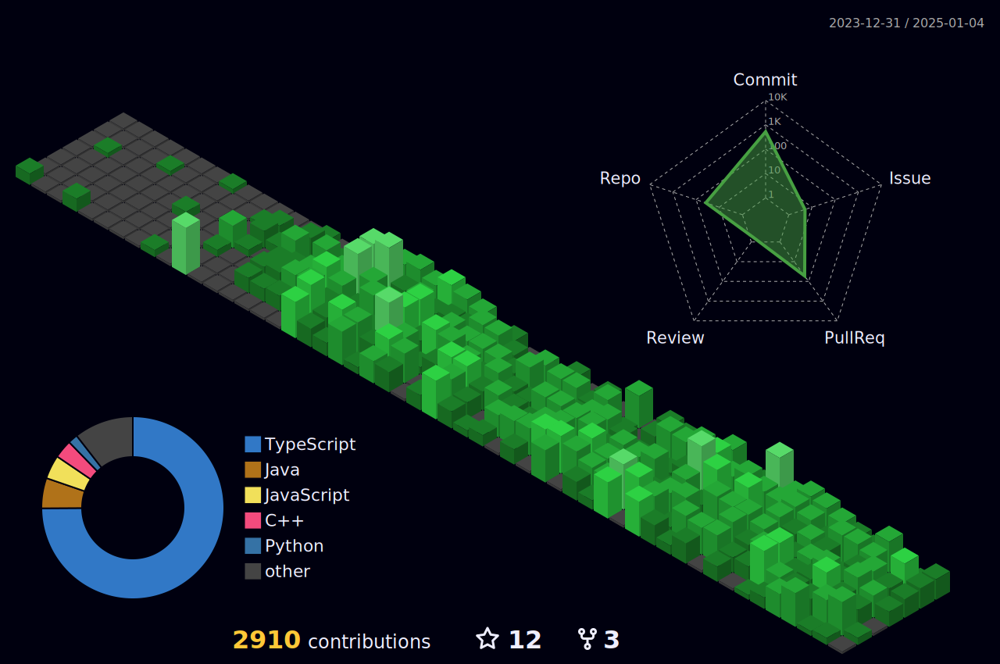

 

  
### 

  
  

   

## Contact Me
  
   

  
| ||
| :-----: | :-: |
| Facebook | [**Nguyễn Văn Nam**](https://www.facebook.com/nam077.me)  |
| Youtube | [**Nam077**](https://www.youtube.com/nam077) |
| Working  | [**Font Việt Hoá NVN**](https://www.facebook.com/nvnfont) |
| University | [**Vietnam-Korea University of Information and Communication Technology**](http://www.vku.udn.vn/) |
| Contact | **<nam077.me@gmail.com>** |
|  |  |
  

  
  
![Metrics](https://metrics.lecoq.io/Nam077?template=classic&isocalendar=1&languages=1&stargazers=1&lines=1&topics=1&stars=1&habits=1&followup=1&reactions=1&people=1&sponsorships=1&sponsors=1&repositories=1&discussions=1&calendar=1&starlists=1&achievements=1&introduction=1&skyline=1&traffic=1&activity=1&notable=1&code=1&gists=1&projects=1&chess=1&fortune=1&stock=1&splatoon=1&poopmap=1&nightscout=1&base=header%2C%20activity%2C%20community%2C%20repositories%2C%20metadata&base.indepth=false&base.hireable=false&base.skip=false&repositories.batch=100&repositories.forks=false&repositories.affiliations=owner&isocalendar=false&isocalendar.duration=half-year&languages=false&languages.limit=8&languages.threshold=0%25&languages.other=false&languages.colors=github&languages.sections=most-used&languages.indepth=false&languages.analysis.timeout=15&languages.analysis.timeout.repositories=7.5&languages.categories=markup%2C%20programming&languages.recent.categories=markup%2C%20programming&languages.recent.load=300&languages.recent.days=14&stargazers=false&stargazers.days=14&stargazers.charts=true&stargazers.charts.type=classic&stargazers.worldmap=false&stargazers.worldmap.sample=0&lines=false&lines.sections=base&lines.repositories.limit=4&lines.history.limit=1&lines.delay=0&topics=false&topics.mode=starred&topics.sort=stars&topics.limit=15&stars=false&stars.limit=4&habits=false&habits.from=200&habits.days=14&habits.facts=true&habits.charts=false&habits.charts.type=classic&habits.trim=false&habits.languages.limit=8&habits.languages.threshold=0%25&followup=false&followup.sections=repositories&followup.indepth=false&followup.archived=true&reactions=false&reactions.limit=200&reactions.limit.issues=100&reactions.limit.discussions=100&reactions.limit.discussions.comments=100&reactions.days=0&reactions.display=absolute&people=false&people.limit=24&people.identicons=false&people.identicons.hide=false&people.size=28&people.types=followers%2C%20following&people.shuffle=false&sponsorships=false&sponsorships.sections=amount%2C%20sponsorships&sponsorships.size=24&sponsors=false&sponsors.sections=goal%2C%20list%2C%20about&sponsors.past=false&sponsors.size=24&sponsors.title=Sponsor%20Me!&repositories=false&repositories.pinned=0&repositories.starred=0&repositories.random=0&repositories.order=featured%2C%20pinned%2C%20starred%2C%20random&discussions=false&discussions.categories=true&discussions.categories.limit=0&starlists=false&starlists.limit=2&starlists.limit.repositories=2&starlists.languages=false&starlists.limit.languages=8&starlists.shuffle.repositories=true&calendar=false&calendar.limit=1&achievements=false&achievements.threshold=C&achievements.secrets=true&achievements.display=detailed&achievements.limit=0&notable=false&notable.from=organization&notable.repositories=false&notable.indepth=false&notable.types=commit&notable.self=false&activity=false&activity.limit=5&activity.load=300&activity.days=14&activity.visibility=all&activity.timestamps=false&activity.filter=all&traffic=false&code=false&code.lines=12&code.load=400&code.days=3&code.visibility=public&gists=false&projects=false&projects.limit=4&projects.descriptions=false&introduction=false&introduction.title=true&skyline=false&skyline.year=current-year&skyline.frames=60&skyline.quality=0.5&skyline.compatibility=false&skyline.settings=%7B%0A%20%20%22url%22%3A%20%22https%3A%2F%2Fskyline.github.com%2F%24%7Blogin%7D%2F%24%7Byear%7D%22%2C%0A%20%20%22ready%22%3A%20%22%5B...document.querySelectorAll('span')%5D.map(span%20%3D%3E%20span.innerText).includes('Share%20on%20Twitter')%22%2C%0A%20%20%22wait%22%3A%201%2C%0A%20%20%22hide%22%3A%20%22button%2C%20footer%2C%20a%22%0A%7D%0A&chess=false&chess.user=.user.login&chess.animation=%7B%0A%20%20%22size%22%3A%2040%2C%0A%20%20%22delay%22%3A%203%2C%0A%20%20%22duration%22%3A%200.6%0A%7D%0A&fortune=false&nightscout=false&nightscout.url=https%3A%2F%2Fexample.herokuapp.com&nightscout.datapoints=12&nightscout.lowalert=80&nightscout.highalert=180&nightscout.urgentlowalert=50&nightscout.urgenthighalert=250&poopmap=false&poopmap.days=7&splatoon=false&splatoon.sections=player%2C%20versus%2C%20salmon-run&splatoon.versus.limit=1&splatoon.salmon.limit=1&splatoon.statink=false&splatoon.source=splatnet&stock=false&stock.duration=1d&stock.interval=5m&config.timezone=Asia%2FBangkok)

## Connect with me  

  

  
  

   

## Github Stats  

  

## Recent Blog Posts  
  

   

  

   

  
  

   

  

   

 

